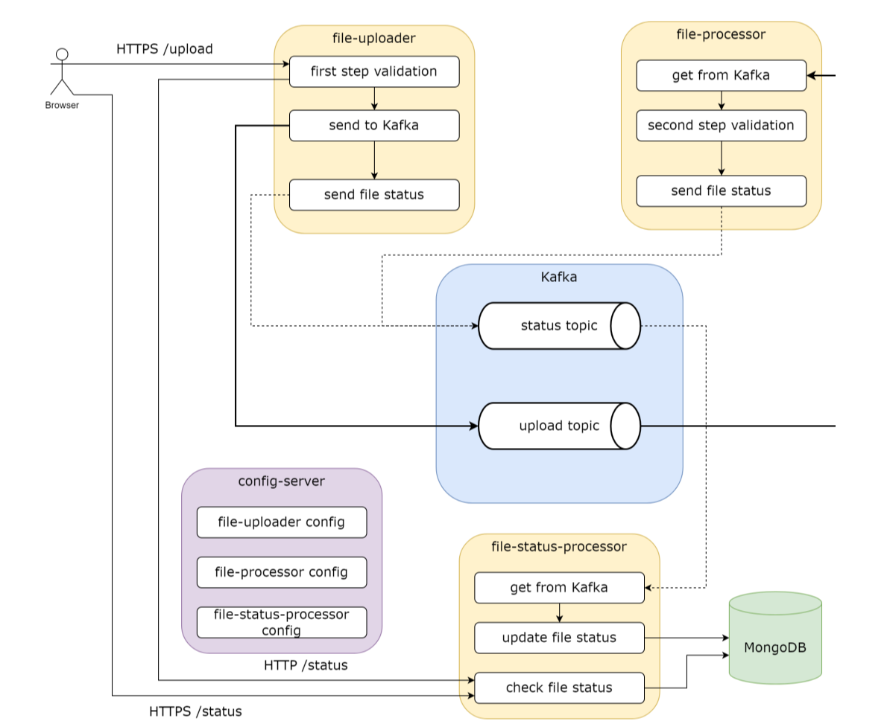

# Firestarter - Система обработки файлов


## Оглавление
- [Обзор](#обзор)
- [Архитектура](#архитектура)
- [Функциональность](#функциональность)
- [Технологии](#технологии)
- [Запуск](#запуск)
- [API](#api)
- [Тестирование](#тестирование)

## Обзор
Firestarter - распределенная система для обработки Excel файлов с двухуровневой валидацией и отслеживанием статусов через Apache Kafka.

**Основные возможности:**
- Загрузка файлов по HTTPS с валидацией
- Асинхронная обработка через Kafka
- Валидация содержимого Excel
- Отслеживание статусов в реальном времени
- Централизованная конфигурация
- Тестовое покрытие >80%

## Архитектура



**Поток данных:**
1. Загрузка → file-uploader → upload-topic
2. Первичная Обработка → file-uploader → status-topic
3. Вторичная Обработка → upload-topic → file-processor → status-topic
4. Сохранение → status-topic → file-status-processor → MongoDB
5. Проверка статусов → file-status-processor → REST API
6. Конфигурация → Spring Cloud Config Server (порт 8888)


## Функциональность

### file-uploader (порт 8081)
- Прием файлов POST /upload
- Валидация: размер ≤5MB, расширения .xls/.xlsx
- Генерация хеша файла
- Отправка в Kafka

### file-processor (порт 8082)
- Валидация содержимого Excel
- Проверка заполненности первых 2 строк и 3 колонок
- Отправка статусов обработки

### file-status-processor (порт 8083)
- Сохранение статусов в MongoDB
- REST API для проверки статусов

## Технологии
- **Java 17, Spring Boot 2.7.0**
- **Apache Kafka, MongoDB**
- **Spring Cloud Config**
- **Docker, Testcontainers**
- **JUnit 5, Mockito, JaCoCo**

## Запуск

### 1. Запуск инфраструктуры
```bash
docker-compose up -d zookeeper kafka mongodb
```

### 2. Сборка проекта
```bash
./gradlew clean build
```

### 3. Запуск микросервисов
```bash

#Терминал 0 - Сервер конфигураций
./gradlew :config-server:bootRun
```

```bash
# Терминал 1 - Статусы
./gradlew :file-status-processor:bootRun

# Терминал 2 - Обработка
./gradlew :file-processor:bootRun

# Терминал 3 - Загрузка
./gradlew :file-uploader:bootRun
```

### 4. Проверка работы
```bash
curl -X POST -F "file=@test.xlsx" http://localhost:8081/upload
```

## API

### Загрузка файла
```bash
POST /upload
Content-Type: multipart/form-data

curl -X POST -F "file=@test.xlsx" http://localhost:8081/upload
```

**Ответ:**
```json
{
  "fileHash": "a1b2c3d4...",
  "status": "File accepted and queued for processing"
}
```

### Проверка статуса
```bash
GET /status/{fileHash}

curl http://localhost:8083/status/9fa9466...
```

**Ответ:**
```json
{
  "id": "68d3b2988d491f14e987db10",
  "fileHash": "9fa9466a0e28960863a7912dd4c2888888167cdb42385ec9a1e049a05544718c",
  "status": "SECONDARY_VALIDATION_FAILED",
  "fileName": "Книга1.xlsx",
  "createdAt": "2025-09-24T11:58:00.206",
  "updatedAt": "2025-09-24T14:11:29.761",
  "errorMessage": "Cell [1,3] is empty. First 3 columns must be filled."
}
```

### Проверка статусов
```bash
GET /status

curl http://localhost:8083/status
```

**Ответ:**
```json
[
  {
    "id": "68d3da13dceefe634826dab5",
    "fileHash": "ebbb581668af4f1c106fbd5d767ee9e2ad560f2d3110035dcf34b496c76f40a6",
    "status": "SECONDARY_VALIDATION_FAILED",
    "fileName": "privetmaket_266421.xlsx",
    "createdAt": "2025-09-24T14:46:27.426",
    "updatedAt": "2025-09-24T14:46:27.426",
    "errorMessage": "Cell [1,2] is empty. First 3 columns must be filled."
  },
  {
    "id": "68d430f4fe260d2075dc12f7",
    "fileHash": "5a3ca213bb69181886c2a464f95279d1b23e9cbf551f093a6f73b8c407a713a4",
    "status": "SECONDARY_VALIDATION_SUCCESS",
    "fileName": "Книга2.xlsx",
    "createdAt": "2025-09-24T20:57:08.028",
    "updatedAt": "2025-09-24T20:57:08.028",
    "errorMessage": null
  }
  
]
```

## Тестирование

### Запуск всех тестов
```bash
./gradlew test
```


### Отчеты покрытия
- Отчеты доступны в `build/reports/jacoco/test/html/index.html`
- Покрытие кода >80%

### Типы тестов
- **Юнит-тесты** - бизнес-логика (Mockito)
- **Интеграционные тесты** - MVC, Kafka, MongoDB (Testcontainers)
- **Тесты API** - REST endpoints (RestAssured)

## Структура проекта
```
firestarter/
├── common/                 # Общие утилиты и модели
├── file-uploader/          # Модуль загрузки файлов
├── file-processor/         # Модуль обработки
├── file-status-processor/  # Модуль статусов
├── config-server/          # Сервер конфигураций
└── docker-compose.yml      # Docker инфраструктура
```

## Конфигурация
Все настройки управляются через Spring Cloud Config Server (порт 8888). Микросервисы получают конфигурацию при запуске.

## Мониторинг
Каждый микросервис предоставляет health-check endpoints:
```bash
curl http://localhost:8081/actuator/health
curl http://localhost:8082/actuator/health  
curl http://localhost:8083/actuator/health
```

## Разработка

### Требования к коду
- Покрытие тестами ≥80%
- Интеграционные тесты с Testcontainers
- Соответствие Java Code Conventions
- Логирование ключевых событий


---

**Firestarter** - надежная и масштабируемая система для обработки файлов с полным циклом тестирования и современной микросервисной архитектурой.
